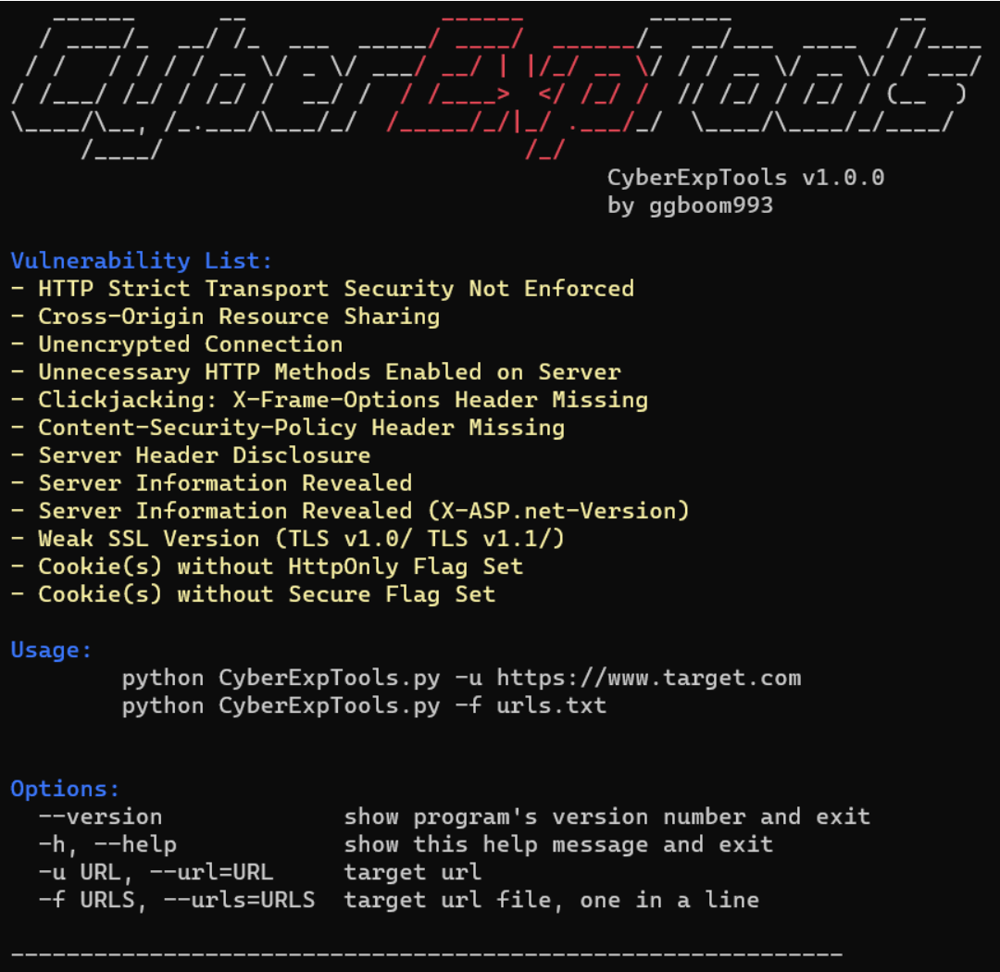

# CyberExpTools

**Just a crap vulnerability detection tool.** 

# Vulnerability List

- HTTP Strict Transport Security Not Enforced
- Cross-Origin Resource Sharing
- Unencrypted Connection
- Unnecessary HTTP Methods Enabled on Server
- Clickjacking: X-Frame-Options Header Missing
- Content-Security-Policy Header Missing
- Server Header Disclosure
- Server Information Revealed
- Server Information Revealed (X-ASP.net-Version)
- Weak SSL Version (TLS v1.0/ TLS v1.1/)
- Cookie(s) without HttpOnly Flag Set
- Cookie(s) without Secure Flag Set

If you have any other **crap vulnerability** that are not on this list, please mention issue and I'll add it.

# Usage

        python3 CyberExpTools.py -u https://www.target.com
        python3 CyberExpTools.py -f urls.txt

# Acknowledgements

https://github.com/linshaoSec/WaterExp
